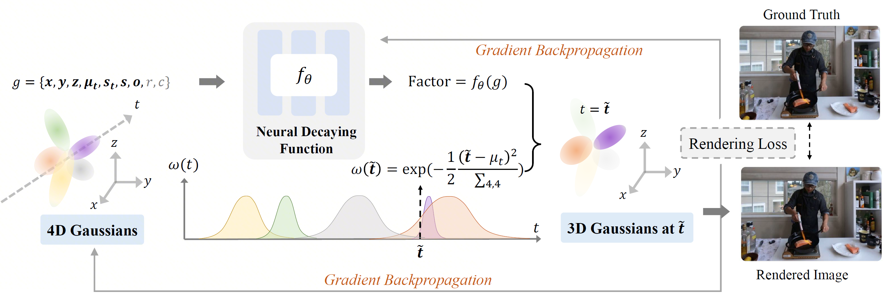

<div align="center">

# 4C4D: 4 Camera 4D Gaussian Splatting

### CVPR 2026

[Junsheng Zhou](https://junshengzhou.github.io/)<sup>#</sup>, Zhifan Yang<sup>#</sup>, Liang Han, [Wenyuan Zhang](https://wen-yuan-zhang.github.io/), Kanle Shi, Shenkun Xu, [Yu-Shen Liu](https://yushen-liu.github.io/)<sup>*</sup>

**Tsinghua University**

<sup>#</sup> Equal contribution &nbsp;&nbsp; <sup>*</sup> Corresponding author

[](https://junshengzhou.github.io/4C4D/)
[](https://arxiv.org/abs/2604.04063)

</div>

---

## Abstract

This paper tackles the challenge of recovering 4D dynamic scenes from videos captured by as few as **four portable cameras**. Learning to model scene dynamics for temporally consistent novel-view rendering is a foundational task in computer graphics, where previous works often require dense multi-view captures using camera arrays of dozens or even hundreds of views. We propose **4C4D**, a novel framework that enables high-fidelity 4D Gaussian Splatting from video captures of extremely sparse cameras. Our key insight is that geometric learning under sparse settings is substantially more difficult than modeling appearance. Driven by this observation, we introduce a **Neural Decaying Function** on Gaussian opacities for enhancing the geometric modeling capability of 4D Gaussians. This design mitigates the inherent imbalance between geometry and appearance modeling in 4DGS by encouraging the 4DGS gradients to focus more on geometric learning. Extensive experiments across sparse-view datasets with varying camera overlaps show that 4C4D achieves **superior performance** over prior art.

## Pipeline

<div align="center">
  
</div>

<p align="center"><em>Figure 1. Overview of the 4C4D framework.</em></p>

We introduce a **Neural Decaying Function** $f_\theta$, implemented as a lightweight neural network, to adaptively control the opacity decay of Gaussians. Given key Gaussian attributes as input, $f_\theta$ predicts a factor that controls the decay of Gaussian opacities. During training, both the Neural Decaying Function and the 4D Gaussians are jointly optimized via gradient backpropagation under a photometric rendering loss.

## Getting Started

### 1. Installation

**Clone and set up the 4C4D environment:**

```bash
git clone https://github.com/yangzf-1023/4C4D
cd 4C4D
conda env create --file environment.yml
conda activate 4c4d
```

**Set up [MASt3R](https://github.com/anttwo/MAtCha) for dense point cloud initialization:**

> Since COLMAP produces extremely sparse point clouds with few input views, we use MASt3R-based reconstruction instead.

```bash
cd ..
git clone https://github.com/anttwo/MAtCha.git
cd MAtCha
python install.py
python download_checkpoints.py
conda activate matcha
```

### 2. Data Preparation

#### Dataset Structure

Whether you use the provided pre-processed data or prepare your own custom dataset, please organize the data directory as follows:

```
data/
├── N3V/                              # or your custom dataset name
│   ├── flame_steak/                  # scene directory
│   │   ├── images/                   # input frames
│   │   │   ├── cam00_0000.png        # format: cam{XX}_{YYYY}.png
│   │   │   ├── cam00_0001.png        #   XX   = camera index (zero-padded)
│   │   │   ├── cam01_0000.png        #   YYYY = frame index  (zero-padded)
│   │   │   └── ...
│   │   └── sparse/
│   │       └── 0/
│   │           ├── cameras.bin       # camera intrinsics  (COLMAP format)
│   │           ├── images.bin        # camera extrinsics  (COLMAP format)
│   │           └── points3D.bin      # reconstructed 3D points
│   ├── cook_spinach/
│   │   ├── images/
│   │   └── sparse/
│   │       └── 0/
│   │           ├── cameras.bin
│   │           ├── images.bin
│   │           └── points3D.bin
│   └── ...                           # additional scenes
```

> **Format note:** Both `.bin` (binary) and `.txt` (text) COLMAP formats are supported for all files under `sparse/0/`.

> **Important — how `sparse/0/` files are generated:**
> - `points3D.*` is always reconstructed from **sparse (training) views only**, since it serves as the point cloud initialization for training.
> - `images.*` and `cameras.*` can be generated from either **sparse views** or **all (dense) views**, depending on whether you need to render/evaluate on held-out test views. If you only train without evaluation, sparse views are sufficient; if you need test-view evaluation, generate them from all views so that test camera poses are included.

#### Pre-processed Data

We provide pre-processed data for all scenes in the Neural 3D Video (N3V) dataset (first 300 frames, using training views `1, 10, 13, 20`). You can download it directly and skip to [Training](#3-training):

> **Download:** [google drive](https://drive.google.com/drive/folders/1bKEMaXSSr7j_awlX3miEHe3-9JvrKIxy?usp=drive_link)

#### Preparing the N3V Dataset from Scratch

If you prefer to process the raw data yourself:

1. Download the [Neural 3D Video dataset](https://github.com/facebookresearch/Neural_3D_Video) and extract each scene to `data/N3V/`.

2. Preprocess the raw video:

```bash
cd ../4C4D
conda activate 4dgs
python scripts/n3v2blender.py data/N3V/$SCENE --training_view $TRAIN_VIEW
```

3. *(Recommended)* Generate dense point clouds with MASt3R for best results:

```bash
# Convert to COLMAP format
python scripts/n3v2colmap.py data/N3V/$SCENE --training_view $TRAIN_VIEW
python scripts/n3v2colmap.py data/N3V/$SCENE

# Run MASt3R reconstruction
cd ../MAtCha
conda activate matcha
python train.py \
  -s ../4C4D/data/N3V/$SCENE/mast3r_${N_SPARSE} \
  -o ../4C4D/data/N3V/$SCENE/mast3r_${N_SPARSE} \
  --sfm_config posed --sfm_only

# Copy reconstructed point cloud
cd ../4C4D
conda activate 4dgs
cp -r data/N3V/$SCENE/mast3r_${N_DENSE}/sparse data/N3V/$SCENE/
cp data/N3V/$SCENE/mast3r_${N_DENSE}/mast3r_sfm/sparse/0/points3D.* \
   data/N3V/$SCENE/sparse/0/
```

#### Preparing Custom Datasets

To use your own data, organize it according to the [Dataset Structure](#dataset-structure) above. Ensure that:

- **`images/`** contains the extracted video frames named as `cam{XX}_{YYYY}.png`, where `XX` is the zero-padded camera index and `YYYY` is the zero-padded frame index.
- **`sparse/0/`** contains valid COLMAP-format camera parameters and point cloud files. You may obtain these via COLMAP, MASt3R, or any other SfM pipeline. Refer to the generation notes above for guidance on which views to use.

<details>
<summary><b>Variable Reference</b></summary>

| Variable       | Description                                          | Example        |
|:---------------|:-----------------------------------------------------|:---------------|
| `$SCENE`       | Scene name from the N3V dataset                      | `flame_steak`  |
| `$TRAIN_VIEW`  | Training view indices (comma-separated)              | `1,10,13,20`   |
| `$N_SPARSE`    | Number of sparse views, equal to `len($TRAIN_VIEW)`  | `4`            |
| `$N_DENSE`     | Total number of views in the scene                   | `21`           |

</details>

### 3. Training

```bash
python train.py \
  --config $CONFIG_PATH \
  --training_view $TRAIN_VIEW \
  --output_dir $OUTPUT_DIR
```

### 4. Visualization

Render a novel-view trajectory after training:

```bash
python render.py \
  --config $CONFIG_PATH \
  --training_view $TRAIN_VIEW \
  --output_dir $OUTPUT_DIR \
  --traj arc \
  --start_checkpoint output/N3V/$SCENE/chkpnt30000.pth
```

### 5. Evaluation

Evaluate on held-out test views:

```bash
python render.py \
  --config $CONFIG_PATH \
  --training_view $TRAIN_VIEW \
  --output_dir $OUTPUT_DIR \
  --test \
  --start_checkpoint output/N3V/$SCENE/chkpnt30000.pth
```

## Citation

If you find this work useful, please consider citing:

```bibtex
@inproceedings{zhou20264c4d,
  title     = {4C4D: 4 Camera 4D Gaussian Splatting},
  author    = {Zhou, Junsheng and Yang, Zhifan and Han, Liang and Zhang, Wenyuan and Shi, Kanle and Xu, Shenkun and Liu, Yushen},
  booktitle = {Conference on Computer Vision and Pattern Recognition (CVPR)},
  year      = {2026}
}
```

## Acknowledgements

Our codebase builds upon [4DGS](https://fudan-zvg.github.io/4d-gaussian-splatting/) and [MASt3R](https://github.com/naver/mast3r). We thank the authors for their excellent work.
